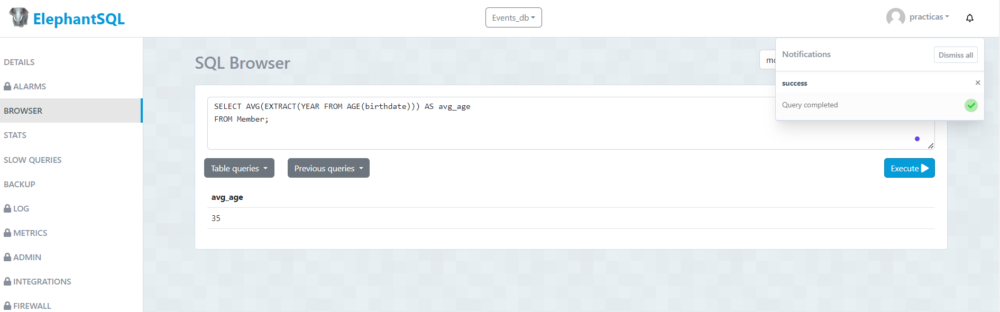
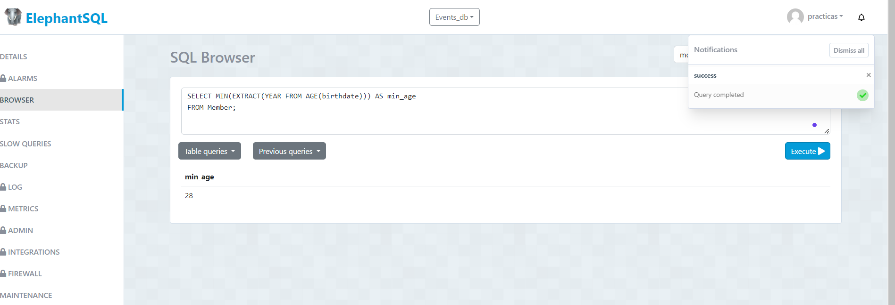
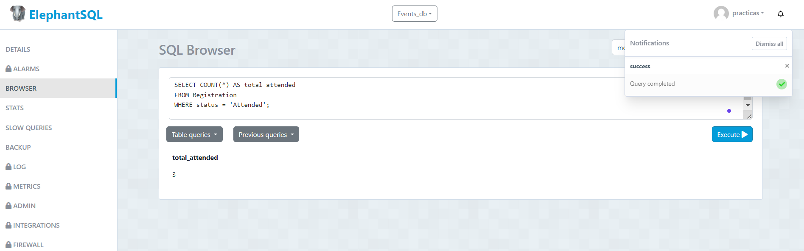
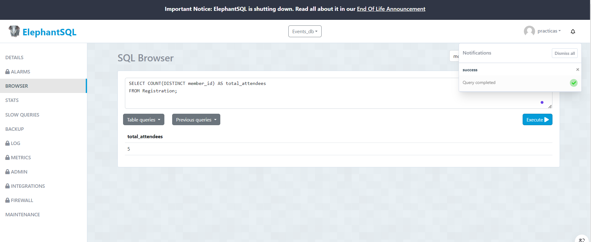
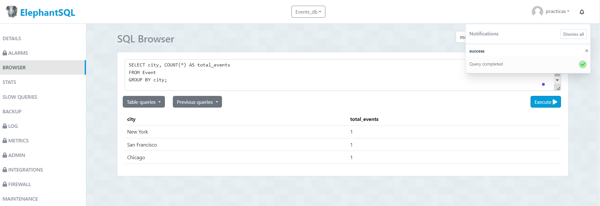
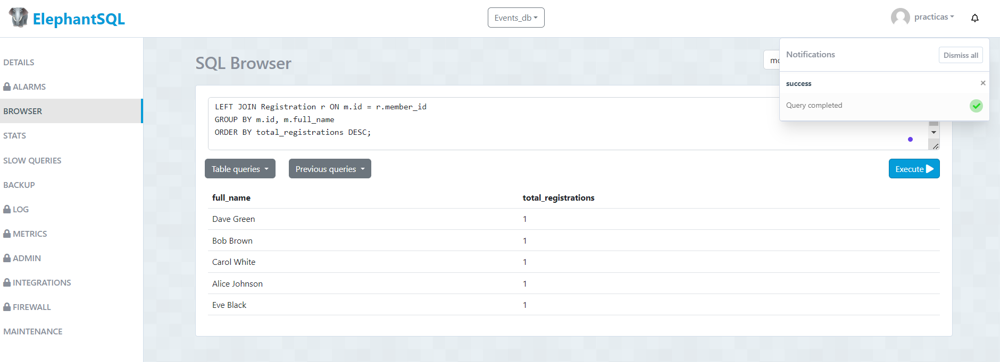
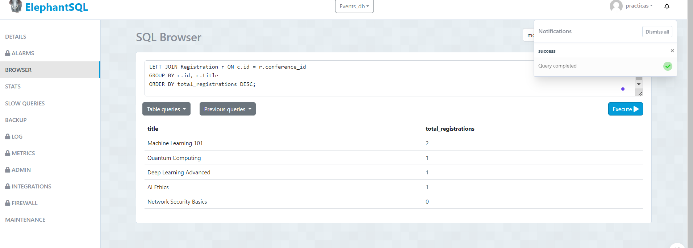

obtener la edad promedio de los miembros:

obtener la edad mínima de los miembros:

obtener el número total de registros asistidos:

obtener el número total de asistentes a todas las conferencias:

obtener el número total de eventos por cada ciudad:

obtener el número de registros por cada miembro:

obtener el número de registros por cada conferencia:

